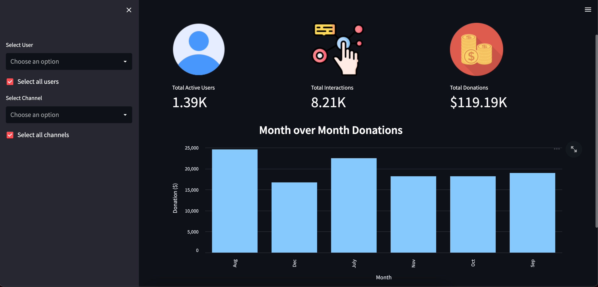

# Streamlit Dashboard
Building an analytics dashboard app using Streamlit.

In this project, I go about building a dashboard with metrics that are geared towards streaming - more specifically live stream chatting and donations.

To get to the final product, I needed to perform multiple steps:
1. Collect relevant data
2. Review and clean the data
3. Decide the most impactful metrics to display
4. Construct the dashboard using Streamlit

The dashboard currently displays top-level metrics that inform the viewer about the health of streaming channels via their total active users, interactions, and donations. The aggregations for these metrics can be modified by the viewer using the dropdowns on the sidebar. The viewer can downselect for specific users and/or channels of interest.

## Resources
Dataset: [Kaggle](https://www.kaggle.com/datasets/mowglii/twitch-chat-test-data)

Metric Icons: [Flaticon](https://www.flaticon.com/)